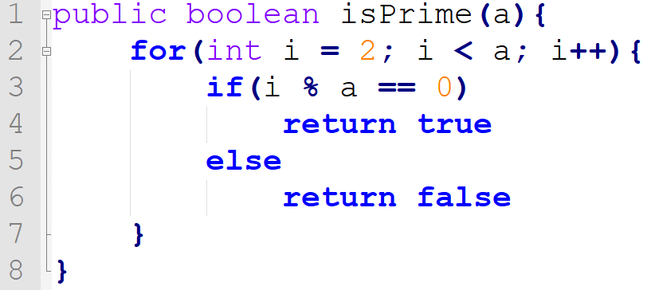

# Number-is-prime
<h3>check the number by dividing the number from 2 to number-1</h3>
The rule is simple: all prime number are only divisible by 1 and by itself. 
So I thought to divide by each number unless for 1 and itself, if the rest is 0 them isn't a prime number 
 

